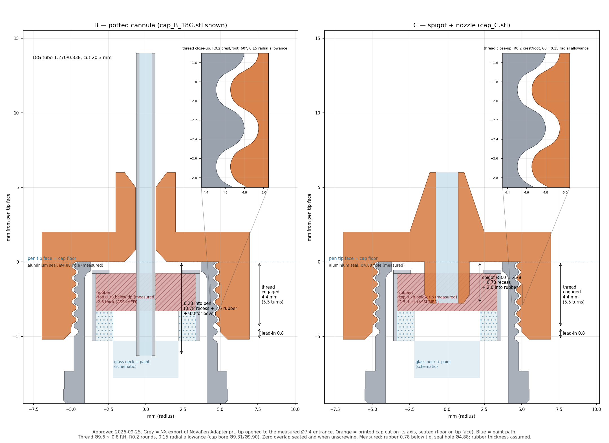

# Pen outlet caps B and C

Screw-on outlet caps for NovoPen-type pens with 3 ml Penfill cartridges, for
dispensing Golden Fluid and High Flow acrylics (see
[`docs/accuracy-test-plan.md`](../docs/accuracy-test-plan.md)). The pen thread
only holds the cap on and never seals: the seal is at the cartridge septum.

- **B, potted cannula:** one straight stainless tube is epoxied into the cap.
  Its sharp end pierces the septum and its blunt end dispenses. At 18G the tube
  cores the rubber, so pierce once and keep one cap per cartridge/colour.
- **C, nozzle cap:** keep the aluminium seal and punch a hole in the rubber
  with a 2.5 mm biopsy punch. The printed Ø3.0 spigot pushes into that hole
  (the interference fit seals), then a straight Ø1.5 bore runs to a nozzle
  with a thin drip edge.

Build A (hypodermic needle + male-male luer + dispensing tip) was dropped: it
traps ~8–25 U and its luer pockets hold air.



## Files

| File | Tube bore | Use |
|---|---|---|
| `stl/cap_B_18G.stl` | Ø1.37 for 18G (1.270 OD / 0.838 ID) | Fluid |
| `stl/cap_B_21G.stl` | Ø0.919 for 21G (0.819 / 0.514) | High Flow |
| `stl/cap_B_22G.stl` | Ø0.818 for 22G (0.718 / 0.413) | High Flow |
| `stl/cap_C.stl` | Ø1.5 paint path | Either; flows ~20× faster than B-18G |

The tube bores include 0.10 mm diametral clearance for epoxy. All four are
binary STLs in millimetres, printed axis-vertical. Source:
[`pen_caps.scad`](pen_caps.scad).

## Pen thread

Taken from the owner's working adapter, `NovaPen Adapter.prt`: a
patent-derived model of the pen's male nose, read natively in NX.

- **Helix:** Ø9.6 × 0.8 mm pitch, right-hand, single start.
- **Groove sketch:** 60° flanks with R0.2 crest and root rounds, 0.293 deep.
- **Tip:** the thread runs out through the tip face.
- **Cap thread:** the same profile moved out radially by **0.15 mm**, the
  convention of the earlier v7 collars r10/r15/r20. That gives a cap bore of
  Ø9.31 at the thread tips and Ø9.90 at the roots.
- **Cap shape:** 0.8 mm plain lead-in, then 4.4 mm (5.5 turns) of thread, and
  the floor seats on the pen tip face.

`part = "nose"` in the .scad rebuilds the nose, and `show_nose = true`
overlays it. OpenSCAD 2021.01's preview garbles the twisted thread in cut
views, so review from rendered meshes, as in `renders/caps_section.png`.

## Measured on the pen (2026-09-25)

| Dimension | Value |
|---|---|
| Pen tip face → rubber outer face | 0.78 mm |
| Hole in the cartridge's aluminium seal | Ø4.88 |
| Pen front entrance | Ø7.4 (the .prt's Ø5.8 lip is not on the real pen) |
| Unthreaded tip beyond the thread | none |
| Septum (rubber) thickness | **not measurable**; 2.5 mm assumed |

The design tolerates the unknown septum thickness:

- **C:** the spigot is 2.78 mm long and enters 2.0 mm into the rubber,
  whatever its thickness.
- **B:** the sharp end reaches 6.28 mm past the floor, which clears up to
  5.5 mm of rubber plus bevel.

To refine this, measure the length of the rubber core the biopsy punch removes
and set `septum_thick`.

## Print and prepare

1. Print in a tough/ABS-like resin. Keep supports off the thread and the paint
   path.
2. IPA-wash and post-cure fully: uncured resin contaminates paint.
3. Ream the bores to size (resin closes up small holes), then flush them.
4. Screw the empty cap onto the pen to check the thread before any assembly.

## Assemble B

1. Cut the tube to **20.3 mm**.
2. Set the sharp (bevel) end **6.28 mm** past the inside of the floor, which
   leaves 8.0 mm of blunt tube beyond the boss.
3. Epoxy from both fillet wells. Keep the pen-side fillet flush with the floor:
   the seal's top is only ~0.5 mm below it.

Tube lumen volume: 11.2 µL (18G), 4.2 µL (21G), 2.7 µL (22G).

## Assemble C

1. Punch the rubber through the seal's hole with a 2.5 mm biopsy punch.
2. Screw the cap on: the Ø3.0 spigot enters the hole with 0.25 mm radial
   interference.

Paint path: 15.5 µL. The part of the punched hole left below the spigot adds
~4.9 µL per mm of rubber beyond 2.0 mm.

## Leak and volume checks

- **Leak test:** fill with dyed water, block the outlet, hold the button for
  30 s, and check each joint.
- **Trapped volume:** weigh the cap empty and water-filled (1 mg = 1 µL).

## Regenerate

```bash
openscad -D 'part="B"' -D tube_od=1.270 -D tube_id=0.838 -o stl/cap_B_18G.stl --export-format binstl pen_caps.scad
openscad -D 'part="C"' -o stl/cap_C.stl --export-format binstl pen_caps.scad
```

A binary STL's size must equal 84 + 50 × its triangle count (header bytes 80–83).

## Verification (2026-09-25)

**Reference nose vs NX.** The OpenSCAD reference nose matches NX's STL export
of `NovaPen Adapter.prt` over the fully formed thread:
- symmetric difference 0.21 mm³ (about 0.001 mm mean over roughly 160 mm² of
  flank);
- a mirrored, left-hand nose misses by 17 mm³, which confirms the right-hand
  thread.

**Caps vs the NX nose.** Each cap was placed against NX's STL of the nose:
- A zero-clearance cap has only one seated angle, the one the model predicts
  (308.25°), which confirms profile and phase.
- All four STLs show zero overlap seated and at 45°–1440° of unscrewing.

**The STL files themselves:**
- binary, with size = 84 + 50 × triangles;
- watertight single solids with consistent winding;
- floor bores as designed (1.370 / 0.919 / 0.818 / 1.497 mm).

Not yet tested physically: print fit on the pen, septum seal, leak
test, trapped volume, flow.
